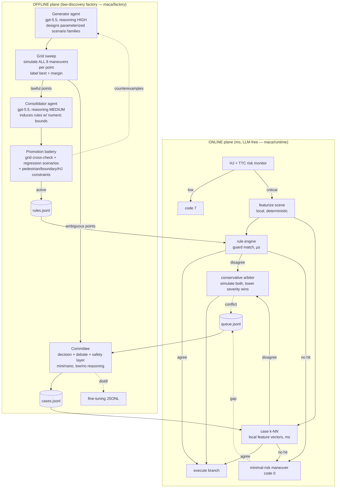

# MACA — Experience-Compiled Multi-Agent Collision Avoidance

> 中文完整上手文档见 **[项目说明与上手指南.md](项目说明与上手指南.md)**
> （含模块级输入输出、库文件字段规范、决策全流程走读、扩展教程与 FAQ）。

MACA is the evolution of the published SACA framework
([arXiv:2504.00115](https://arxiv.org/abs/2504.00115)) into a **two-plane
architecture**: a multi-agent LLM system discovers collision-avoidance *laws*
offline and compiles them into a rule/case library; the online plane executes
that compiled library with **zero LLM calls and zero network** on the
critical path — real-time by construction, regardless of library size.

### Architecture evolution

| Stage | Architecture | Trigger-path latency | Limitation |
|---|---|---|---|
| v0 (legacy SACA) | one LLM call at decision time | seconds | never meets the window |
| v1 (anticipatory multi-agent) | background deliberation arms a policy tree; trigger = cache lookup | ms lookup, but 12–135 s deliberation rarely fits the anticipation window | first encounters unsafe |
| **v2 (this repo)** | **all LLM work offline; runtime = compiled rule/case matching** | **1–2 ms, constant** | uncovered scenes degrade to the minimal-risk maneuver and auto-queue for the factory |



## The real-time story

An LLM call takes seconds; an extreme avoidance window is <300 ms. MACA's
answer: **the LLM never runs online at all**. Deliberation is amortized
offline into two compiled artifacts:

- **Rules** — empirical laws with machine-checkable guards (discrete
  membership + numeric ranges over a deterministic feature language) and a
  contingency policy tree payload. Matching is O(rules × guards): **~0.01 ms**.
- **Cases** — verified policies for the regions where no law exists
  (harmful near-ties, vulnerable-road-user trade-offs). The k-NN query
  vector is built from scene physics locally — **no API embedding** — so
  lookup is pure numpy: ~1 ms at 10³ cases, ~10 ms at 10⁵. Library growth
  does not threaten the deadline.
- **Conflict arbitration** — when rule and case disagree, both branches are
  simulated locally and the lower-severity one executes (**~0.07 ms**); the
  conflict is queued for offline debate, whose resolution retires the losing
  entry (self-healing).
- **Fallback** — no coverage → minimal-risk maneuver (code 0) + the gap is
  queued for the factory. Control authority is never suspended.

Measured on the demo scenarios: **total trigger-path latency 1.3–2.5 ms**
(HJ monitor ~1 ms + featurize ~0.03 ms + rule match ~0.01 ms + case k-NN
~0.4 ms + branch classification ~0.1 ms).

## The law-discovery factory (offline, where the thinking happens)

One factory batch (`python -m maca.factory --batch 1`):

1. **Queue drain** — runtime gaps and conflicts go to the committee
   (conflicts get a mandatory debate); results become cases; conflict
   resolutions retire overruled cases.
2. **Generator agent** (gpt-5.5, reasoning=high) designs a *parameterized
   scenario family*: pattern (lateral_crossing / lead_braking / cut_in /
   static_blockage), context (topology, pedestrian side, boundaries, blocked
   corridor, follower) and swept parameter ranges. Raw coordinates are never
   LLM-generated — instantiation is deterministic, so physical plausibility
   is guaranteed by construction.
3. **Grid sweep** (deterministic) — each grid point simulates ALL 8 maneuver
   codes and ranks them by severity. Points where one maneuver clearly
   dominates (margin ≥ 1 class) or a mild action fully resolves the scene
   are **lawful**; harmful near-ties and points whose best option still
   harms a vulnerable road user are **ambiguous**.
4. **Consolidator agent** (gpt-5.5, reasoning=medium) induces general rules
   from the lawful region. Every proposal is **numerically cross-checked
   point-by-point against the grid** (hallucinated bounds bounce back with
   the mismatch list); verified proposals become candidates.
5. **Promotion battery** — candidates must pass their source grid, the
   static regression scenarios, and pedestrian-side/boundary/HJ constraints
   at ≥90% before becoming active. Active rules are sample-re-validated
   every batch against their re-instantiated source families (anti-drift);
   failures are deprecated.
6. **Committee** (decision gpt-5.4-mini/no-reasoning + debate advocates/
   arbiter gpt-5.4-mini/low + deterministic safety layer) deliberates the
   ambiguous points into cases, with a veto → re-decide loop; every case
   carries a lesson and is exported as a fine-tuning sample
   (`fine-tuning/maca_distill.jsonl`).

### Coverage-gated activation (the factory only works where the library fails)

Every LLM expenditure is gated on **non-coverage**: a scene/grid-point is
*covered* when an active rule matches its features with a severity-optimal
maneuver, or a case above the runtime similarity gate does. Covered queue
items are skipped; consolidation is skipped when the lawful region is
already ruled; committee time goes only to uncovered ambiguous points; a
conflict whose winning case is itself an offline resolution is treated as
adjudicated and never re-queued. A rule that *matches but is
severity-suboptimal* is not coverage — it is a **counterexample**, fed to
the consolidator for tightening (this is how imperfect seed domain rules
get corrected by evidence, e.g. the escape window inside the T-drift
rule's claimed region).

### Demo scenarios (each exercises a different strategy / tier)

| Scenario | Best maneuver | Online path |
|---|---|---|
| `test1` | 6 T-drift right — rear impact, sev 3 (vs sev-4 side otherwise) | seed rule + case agree |
| `cross_right_tdrift` | 5 T-drift left — rear impact, sev 3 (mirror) | seed rule + case agree |
| `cross_escape` | 2 sharp right lane change — near miss, sev 1 | case overrides the overclaiming T-drift seed rule via conservative arbitration |
| `test2` | 0 braking — sev 0 | seed brake rule + case agree |
| `cut_in_brake` | 0 braking vs a cutting-in SUV — sev 0 | seed brake rule + case agree |
| `highway_brake` | 0 braking — front impact, sev 3 (least harm) | case (former runtime gap) |
| `blockage_left_escape` | 0 braking — front impact, sev 3; commit condition (cannot brake out, but braking still least-harm) | case (former gap) |
| `moving_obstacle` | 1 sharp left lane change (MOVING obstacle) — sev 0 | case (former gap) |
| `low_risk` | 7 no intervention | reflex pass-through |

## Medium-fidelity dynamics simulator (the factory's ground truth)

[maca/tools/simulator.py](maca/tools/simulator.py) — the ego is a rectangular
**oriented bounding box** (4.6×1.9 m, heading-aware; contact + impact face
judged in the body frame so they rotate with heading), targets are
type-radius circles; horizon ≤ 2.5 s. Commands pass through **friction-circle
coupling** (‖a‖ ≤ μg, μ=0.9; a higher slip cap for drift) and **actuator
dynamics** (first-order lag τ=0.12 s + jerk limit 40 m/s³) before integration,
so a maneuver can realistically be started too late. Ego profiles: AEB =
−8 m/s²; sharp lane change = bang-bang lateral ±3 m/s² to a 4 m offset;
lane change with braking adds −4 m/s² longitudinal; **T-drift is two-phase** —
a ~0.9 s rotation to perpendicular (−5 long. + ±5 lateral kick), then a
saturated skid that scrubs the velocity vector to rest, so the trajectory is
bounded and physical instead of sliding off. Honest result: T-drift converts
an unavoidable **sev-4 side** impact into a survivable **sev-3 rear** impact.
A pluggable backend (`maca/tools/sim_backends/`) admits an optional CARLA
stub for offline cross-validation, never on the hot path.

**Everything around the ego moves too.** Obstacles carry an optional
velocity (lost cargo, runaway trailers); traffic participants follow
intention-driven behavior models: *Maintain* = constant velocity,
*Emergency Braking* = −6 m/s² along the motion direction until standstill,
*Lane Change* = the lateral component settles to zero after 4 m of lateral
travel (the vehicle merges instead of drifting sideways forever). Policy
branches are validated under their own evolution hypothesis (the primary
threat maintaining / yielding / accelerating ×1.3).

Severity 0–4 from contact relative speed, adjusted by impact face (rear −1:
energy absorbing; side +1: weak structure / EV battery; vulnerable road
user +2) plus road-boundary departures. **HJ reachability** serves as a
state-risk *reference*: the reflex monitor's risk signal, and a validation
constraint (a maneuver's end state must not worsen the no-intervention
baseline). Two runtime signals are simulation-grounded rather than
heuristic: `braking_sufficient` (code 0 actually resolves the scene) and
the commit condition (critical band, OR an on-collision-course threat that
braking can no longer resolve).

## Usage

```bash
conda activate llm_control
pip install -r requirements.txt

# ONLINE (no API key needed — nothing to call):
python -m maca.run --scenario test1     # rule hit -> T-drift, ~2 ms
python -m maca.run --scenario low_risk  # reflex pass-through
python -m maca.run --stats              # library statistics

# OFFLINE factory (needs OPENAI_API_KEY in .env; or --mock for offline demo):
python -m maca.factory --batch 1                  # full loop
python -m maca.factory --batch 0 --source queue   # drain gaps/conflicts only
python -m maca.factory --batch 1 --mock           # deterministic offline run
```

Factory model roles ([maca/config.py](maca/config.py), override via
`MACA_MODEL_<ROLE>` / `MACA_EFFORT_<ROLE>`): generator gpt-5.5/high,
consolidator gpt-5.5/medium, decision gpt-5.4-mini/none, advocates+arbiter
gpt-5.4-mini/low, evaluation gpt-5.4-nano/none.

## Library format (extensible by design)

`maca/library/rules.jsonl` — one rule per line: guards (any subset of the
feature language — new features become matchable without engine changes),
policy tree, status (candidate/active/deprecated), provenance (source family,
re-instantiable for re-validation) and battery stats. Seed rules encode the
published SACA domain knowledge (T-drift left/right, braking sufficiency).
`cases.jsonl` — feature vector + policy + lesson (+ retired flag when
overruled). `queue.jsonl` — runtime gaps/conflicts awaiting the factory.

## Repository layout

```
maca/runtime/    online plane: monitor, features, rule engine, case index,
                 arbiter, executor, gaps  (no openai import anywhere)
maca/factory/    offline plane: generator, instantiate, sweep, consolidator,
                 validator, committee, factory CLI
maca/library/    rules.jsonl / cases.jsonl / queue.jsonl + store
maca/tools/      medium-fidelity simulator + physics helpers + sim_backends/
maca/risk/       HJ value network (HJ_Reachability/safe_value_params.pth)
maca/scenario/   scenario schema/loader + demo scenarios (+ generated/)
HJ_Reachability/ trained HJ value-network weights
paper/           IEEEtran conference paper (maca.tex)
Results/         online run logs + factory batch reports + growth log
```

## Current status & verification (2026-07)

> Numbers below are the clean deliverable state **after recalibrating for the
> medium-fidelity dynamics simulator**. The library ships as a seed baseline
> (domain rules + calibrated seed cases) that the factory extends.

- **Scenarios**: 9 demo scenarios covering maneuver codes 0/1/2/5/6/7 (a
  MOVING obstacle, a T-drift over-claim corrected by a case, blocked
  corridors, and the braking-insufficiency commit condition — each exercises
  a different online tier). Lane-change-with-braking (codes 3/4) is rarely
  strictly optimal in any single scene under the realistic dynamics — a
  faithful physical finding — so it lives as a conditional policy-tree branch
  rather than a standalone demo.
- **Libraries**: 3 domain seed rules (`seed-tdrift-left/right`,
  `seed-brake-sufficient`; the T-drift guards widened for the new physics —
  `threat_kind ∈ {truck,suv,car}`, `lateral_dist ≤ 13 m`) + **13 cases**: 8
  calibrated seeds (one per non-trivial scenario, code = simulated-optimal,
  features taken from the scenario so k-NN self-matches, with honest simulated
  severities/outcomes; `cross_escape` marked adjudicated) **plus 5 grown by the
  real factory** — 3 from committee deliberation of ambiguous sweep points and
  2 from queued runtime VRU-trade-off gaps, each independently re-verified to be
  the simulator's least-harm (or tied-least-harm) action.
- **Feature vector**: 32-D (8 numeric + 8 approach sectors + 3 pedestrian
  sides + 3 topologies + 6 threat kinds + 4 booleans); online extraction
  dimension equals stored case-vector dimension (the k-NN interlock).
- **Growth log**: every factory event (case generation with its simulated
  judgment + lesson, rule induction/promotion, amendments, re-validation) is
  appended in human-readable form, with a self-documenting legend header, to
  `Results/factory/library_growth.log` (`tail -f` to watch the factory work).
- **Verified end-to-end**: all 9 scenarios decide correctly online (9/9) with
  the feedback queue stable at 0 (1–2 ms warm trigger path, measured max
  1.53 ms, ~15 ms cold due to torch first inference, zero LLM / zero network —
  runnable with `OPENAI_API_KEY=` unset); the analytic simulator is
  deterministic and rank/single-call consistent, HJ baseline deterministic and
  reproducible; the offline factory grows the library under the new physics and its
  growth log records the full pipeline; the self-healing loop was exercised
  end to end — an injected uncovered scene goes MRM+gap → factory deliberates
  → case created → same scene then hits the case; conservative arbitration
  resolves the `cross_escape` rule/case conflict to the lower-severity escape.
- **Simulator physics (medium-fidelity)**: rectangular OBB collision with
  body-frame impact face, friction-circle coupling (|a| ≤ μg), first-order
  actuator lag + jerk limiting. T-drift is modeled in **two phases** — a ~0.9 s
  rotation to perpendicular, then a saturated **skid** that scrubs the velocity
  vector to rest — so the trajectory is bounded and physical (the car stops
  rotated after sliding a few metres) rather than sliding off unboundedly, while
  the early impact-phase geometry (and thus the crash severity) is unchanged.
  The honest T-drift result: it converts an unavoidable **severity-4 side**
  impact into a survivable **severity-3 rear** impact.
- **Simulator backends**: default `analytic` (millisecond, on the hot path);
  optional `carla` stub with an integration doc for offline high-fidelity
  cross-validation (`maca/tools/sim_backends/`).
- **Doomed-gap filter**: the queue path mirrors the sweep's `doomed`-point
  filter — a gap in which every maneuver is maximally severe (no discrimination)
  is dropped rather than compiled into a misleading "recommend maneuver X" case.
- **Known gaps (honest)**: the seed T-drift rule is intentionally broad and
  over-claims `cross_escape` (corrected online by a case via conservative
  arbitration, marked adjudicated so it does not re-queue). Fault injection also
  showed the primary-threat-keyed seed rule does not itself check the escape
  corridor for a **secondary** vehicle — a drift can fire toward an occupied
  side; the designed remedy is the counterexample→sweep→tightened-guard loop,
  with online conservative arbitration as the backstop until that batch runs.
  Changing the 32-D feature encoding requires re-coverage, handled by the
  passive gap→rebuild loop rather than an active re-encoder.

## Security note

API keys live in `.env` (git-ignored) and are needed by the factory only.
The keys once hardcoded in the legacy `config.py`/`API_key.md` must be
treated as compromised — revoke and re-issue them.

## License / Contact

MIT. shiyuez.umich@gmail.com
